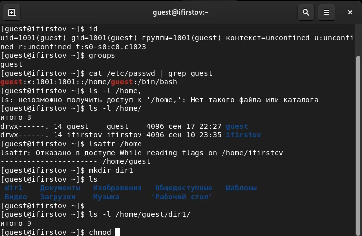

---
## Front matter
lang: ru-RU
title: Structural approach to the deep learning method
author: |
	Leonid A. Sevastianov\inst{1,3}
	\and
	Anton L. Sevastianov\inst{1}
	\and
	Edik A. Ayrjan\inst{2}
	\and
	Anna V. Korolkova\inst{1}
	\and
	Dmitry S. Kulyabov\inst{1,2}
	\and
	Imrikh Pokorny\inst{4}
institute: |
	\inst{1}RUDN University, Moscow, Russian Federation
	\and
	\inst{2}LIT JINR, Dubna, Russian Federation
	\and
	\inst{3}BLTP JINR, Dubna, Russian Federation
	\and
	\inst{4}Technical University of Košice, Košice, Slovakia
date: NEC--2019, 30 September -- 4 October, 2019 Budva, Montenegro

## Formatting
toc: false
slide_level: 2
theme: metropolis
header-includes: 
aspectratio: 43
section-titles: true
---

# Теоретическое введение

В операционной системе Linux есть много отличных функций безопасности, но она из самых важных - это система прав доступа к файлам. Linux, как последователь идеологии ядра Linux в отличие от Windows, изначально проектировался как многопользовательская система, поэтому права доступа к файлам в linux продуманы очень хорошо.

Изначально каждый файл имел три параметра доступа. Вот они:

    Чтение - разрешает получать содержимое файла, но на запись нет. Для каталога позволяет получить список файлов и каталогов, расположенных в нем;
    Запись - разрешает записывать новые данные в файл или изменять существующие, а также позволяет создавать и изменять файлы и каталоги;
    Выполнение - вы не можете выполнить программу, если у нее нет флага выполнения. Этот атрибут устанавливается для всех программ и скриптов, именно с помощью него система может понять, что этот файл нужно запускать как программу.

Но все эти права были бы бессмысленными, если бы применялись сразу для всех пользователей. Поэтому каждый файл имеет три категории пользователей, для которых можно устанавливать различные сочетания прав доступа:

    Владелец - набор прав для владельца файла, пользователя, который его создал или сейчас установлен его владельцем. Обычно владелец имеет все права, чтение, запись и выполнение.
    Группа - любая группа пользователей, существующая в системе и привязанная к файлу. Но это может быть только одна группа и обычно это группа владельца, хотя для файла можно назначить и другую группу.
    Остальные - все пользователи, кроме владельца и пользователей, входящих в группу файла.

# Выполнение лабораторной работы

Создание нового пользователя 

{ #fig:001 width=70% }

Вход в систему от имени нового пользователя и проверка 

{ #fig:002 width=70% }

Манипуляции с папками 

{ #fig:003 width=70% }

Различные права доступа 

{ #fig:004 width=70% }

## {.standout}

