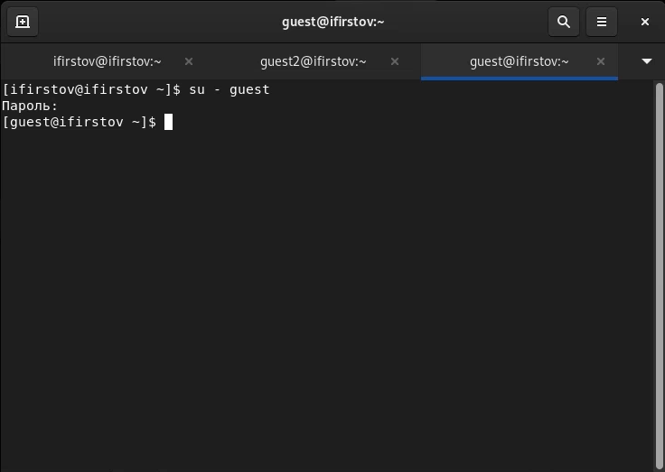

---
## Front matter
lang: ru-RU
title: Lab3

## Formatting
toc: false
slide_level: 2
theme: metropolis
header-includes: 
aspectratio: 43
section-titles: true
---

# Теоретическое введение

В операционной системе Linux есть много отличных функций безопасности, но она из самых важных - это система прав доступа к файлам. Linux, как последователь идеологии ядра Linux в отличие от Windows, изначально проектировался как многопользовательская система, поэтому права доступа к файлам в linux продуманы очень хорошо.

Изначально каждый файл имел три параметра доступа. Вот они:

    Чтение - разрешает получать содержимое файла, но на запись нет. Для каталога позволяет получить список файлов и каталогов, расположенных в нем;
    Запись - разрешает записывать новые данные в файл или изменять существующие, а также позволяет создавать и изменять файлы и каталоги;
    Выполнение - вы не можете выполнить программу, если у нее нет флага выполнения. Этот атрибут устанавливается для всех программ и скриптов, именно с помощью него система может понять, что этот файл нужно запускать как программу.

Но все эти права были бы бессмысленными, если бы применялись сразу для всех пользователей. Поэтому каждый файл имеет три категории пользователей, для которых можно устанавливать различные сочетания прав доступа:

    Владелец - набор прав для владельца файла, пользователя, который его создал или сейчас установлен его владельцем. Обычно владелец имеет все права, чтение, запись и выполнение.
    Группа - любая группа пользователей, существующая в системе и привязанная к файлу. Но это может быть только одна группа и обычно это группа владельца, хотя для файла можно назначить и другую группу.
    Остальные - все пользователи, кроме владельца и пользователей, входящих в группу файла.

# Выполнение лабораторной работы

Создание нового пользователя

{ #fig:001 width=70% }

Добавление в группу

{ #fig:002 width=70% }

Вкладки от имени пользователей

{ #fig:003 width=70% }

Приинадлежность пользователя guest2

{ #fig:004 width=70% }

Установка прав доступа

{ #fig:005 width=70% }

## {.standout}

