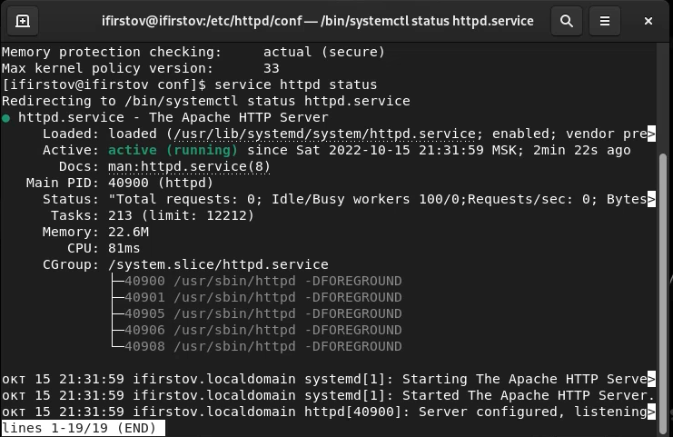

---
## Front matter
lang: ru-RU
title: Lab3

## Formatting
toc: false
slide_level: 2
theme: metropolis
header-includes: 
aspectratio: 43
section-titles: true
---

# Теоретическое введение

Apache HTTP-сервер (является искажённым сокращением от англ. a patchy server; среди русских пользователей общепринято переводное апа́ч) — свободный веб-сервер.

Apache является кроссплатформенным ПО, поддерживает операционные системы Linux, BSD, macOS, Microsoft Windows, Novell NetWare, BeOS.

Основными достоинствами Apache считаются надёжность и гибкость конфигурации. Он позволяет подключать внешние модули для предоставления данных, использовать СУБД для аутентификации пользователей, модифицировать сообщения об ошибках и т. д. Поддерживает IPv4. 

SELinux (англ. Security-Enhanced Linux — Linux с улучшенной безопасностью) — реализация системы принудительного контроля доступа, которая может работать параллельно с классической избирательной системой контроля доступа. 

Оставаясь в рамках избирательной системы контроля доступа, операционная система имеет фундаментальное ограничение в плане разделения доступа процессов к ресурсам — доступ к ресурсам основывается на правах доступа пользователя. Это классические права rwx на трех уровнях — владелец, группа-владелец и остальные. 

# Выполнение лабораторной работы

{ #fig:001 width=70% }

{ #fig:002 width=70% }

{ #fig:003 width=70% }

{ #fig:004 width=70% }

{ #fig:005 width=70% }

{ #fig:006 width=70% }

{ #fig:007 width=70% }

{ #fig:007 width=70% }

## {.standout}

