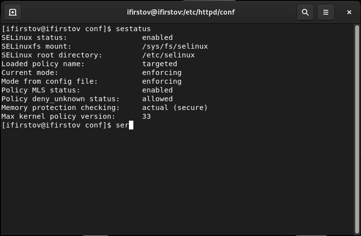
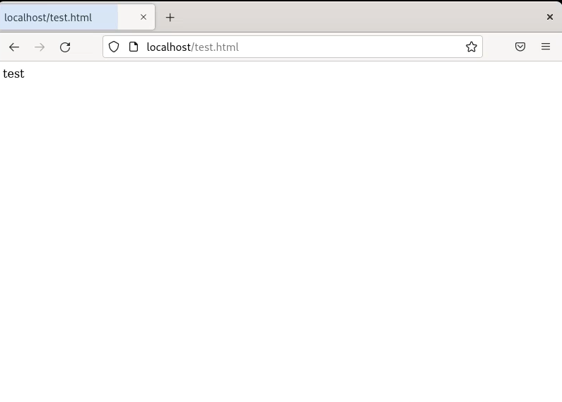

---
# Front matter
title: "Лабораторная работа 6"
subtitle: "Мандатное разграничение прав в Linux"
author: "Илья Валерьевич Фирстов"

# Generic otions
lang: ru-RU
toc-title: "Содержание"

# Bibliography
bibliography: bib/cite.bib
csl: pandoc/csl/gost-r-7-0-5-2008-numeric.csl

# Pdf output format
toc: true # Table of contents
toc_depth: 2
lof: true # List of figures
lot: true # List of tables
fontsize: 12pt
linestretch: 1.5
papersize: a4
documentclass: scrreprt
## I18n
polyglossia-lang:
  name: russian
  options:
	- spelling=modern
	- babelshorthands=true
polyglossia-otherlangs:
  name: english
### Fonts
mainfont: comic.ttf
romanfont: comic.ttf
sansfont: comic.ttf
monofont: comic.ttf
mainfontoptions: Ligatures=TeX
romanfontoptions: Ligatures=TeX
sansfontoptions: Ligatures=TeX,Scale=MatchLowercase
monofontoptions: Scale=MatchLowercase,Scale=0.9
## Biblatex
biblatex: true
biblio-style: "gost-numeric"
biblatexoptions:
  - parentracker=true
  - backend=biber
  - hyperref=auto
  - language=auto
  - autolang=other*
  - citestyle=gost-numeric
## Misc options
indent: true
header-includes:
  - \linepenalty=10 # the penalty added to the badness of each line within a paragraph (no associated penalty node) Increasing the value makes tex try to have fewer lines in the paragraph.
  - \interlinepenalty=0 # value of the penalty (node) added after each line of a paragraph.
  - \hyphenpenalty=50 # the penalty for line breaking at an automatically inserted hyphen
  - \exhyphenpenalty=50 # the penalty for line breaking at an explicit hyphen
  - \binoppenalty=700 # the penalty for breaking a line at a binary operator
  - \relpenalty=500 # the penalty for breaking a line at a relation
  - \clubpenalty=150 # extra penalty for breaking after first line of a paragraph
  - \widowpenalty=150 # extra penalty for breaking before last line of a paragraph
  - \displaywidowpenalty=50 # extra penalty for breaking before last line before a display math
  - \brokenpenalty=100 # extra penalty for page breaking after a hyphenated line
  - \predisplaypenalty=10000 # penalty for breaking before a display
  - \postdisplaypenalty=0 # penalty for breaking after a display
  - \floatingpenalty = 20000 # penalty for splitting an insertion (can only be split footnote in standard LaTeX)
  - \raggedbottom # or \flushbottom
  - \usepackage{float} # keep figures where there are in the text
  - \floatplacement{figure}{H} # keep figures where there are in the text
---

# Цель работы

c. Получить первое практическое знакомство с технологией SELinux. Проверить работу SELinx на практике совместно с веб-сервером Apache

# Задание

Развить навыки администрирования ОС Linux

# Теоретическое введение

Apache HTTP-сервер (является искажённым сокращением от англ. a patchy server; среди русских пользователей общепринято переводное апа́ч) — свободный веб-сервер.

Apache является кроссплатформенным ПО, поддерживает операционные системы Linux, BSD, macOS, Microsoft Windows, Novell NetWare, BeOS.

Основными достоинствами Apache считаются надёжность и гибкость конфигурации. Он позволяет подключать внешние модули для предоставления данных, использовать СУБД для аутентификации пользователей, модифицировать сообщения об ошибках и т. д. Поддерживает IPv4. 

# Выполнение лабораторной работы

Проверил режим работы SELinux (рис. [-@fig:001])

{ #fig:001 width=70% }

Проверил работу сервера apache (рис. [-@fig:002])

{ #fig:002 width=70% }

Провверил состояние переключателей SELinux для Apache(рис. [-@fig:003])

{ #fig:003 width=70% }

Определите тип файлов и поддиректорий, находящихся в директории /var/www, после чего создал файл test.html (рис. [-@fig:004])

{ #fig:004 width=70% }

Зашел через браузер и проверил отображение файла test.html.(рис. [-@fig:005])

{ #fig:005 width=70% }

Изменил контекст test.html.(рис. [-@fig:006])

{ #fig:006 width=70% }

Зашел через браузер и снова проверил отображение файла test.html. Из-за изменения контекста произошла ошибка доступа(рис. [-@fig:007])

{ #fig:007 width=70% }

В логах также отображается ошибка доступа(рис. [-@fig:007])

{ #fig:007 width=70% }

# Выводы

Я развил навыки администрирования ОС Linux

# Список литературы{.unnumbered}

https://ru.wikipedia.org/wiki/Apache_HTTP_Server
