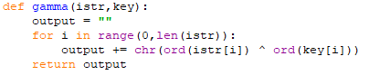
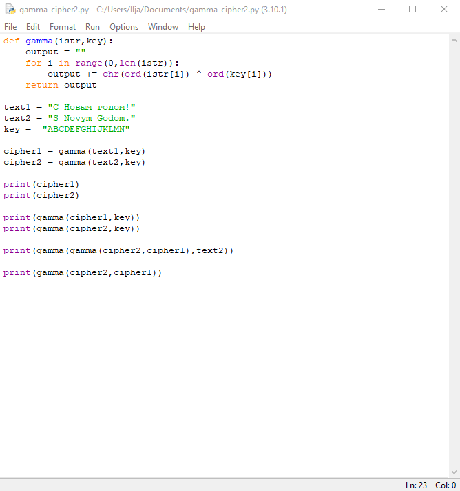
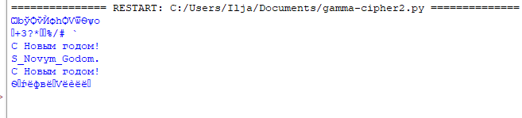

---
## Front matter
lang: ru-RU
title: Lab3

## Formatting
toc: false
slide_level: 2
theme: metropolis
header-includes: 
aspectratio: 43
section-titles: true
---

# Теоретическое введение

Предложенная Г. С. Вернамом так называемая «схема однократного использования (гаммирования)» (рис. 7.1) является простой, но надёжной схемой шифрования данных.

Гаммирование представляет собой наложение (снятие) на открытые (зашифрованные) данные последовательности элементов других данных, полученной с помощью некоторого криптографического алгоритма, для получения зашифрованных (открытых) данных. Иными словами, наложение гаммы — это сложение её элементов с элементами открытого (закрытого) текста по некоторому фиксированному модулю, значение которого представляет собой известную часть алгоритма шифрования.

# Выполнение лабораторной работы

{ #fig:001 width=70% }

{ #fig:002 width=70% }

{ #fig:003 width=70% }

## {.standout}

